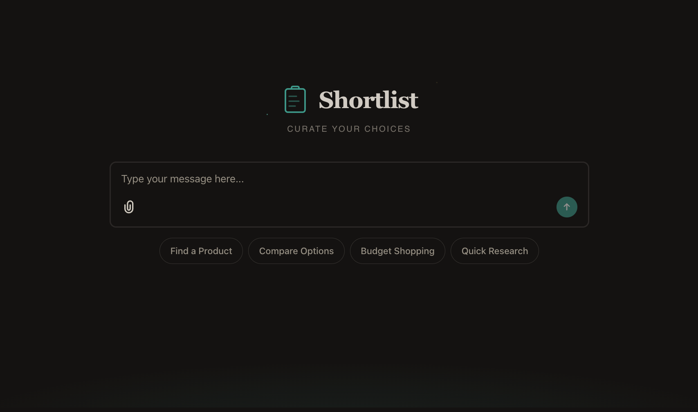
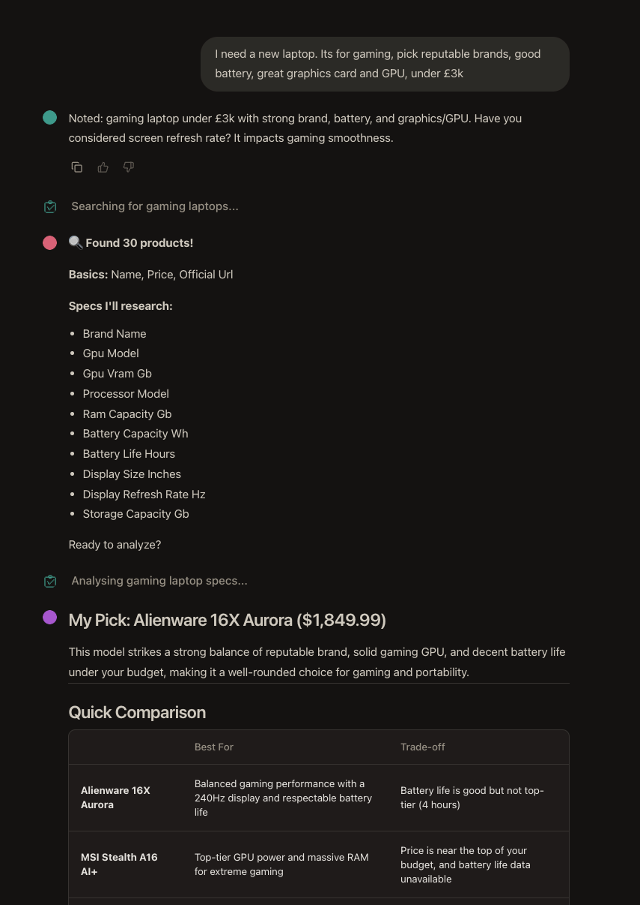
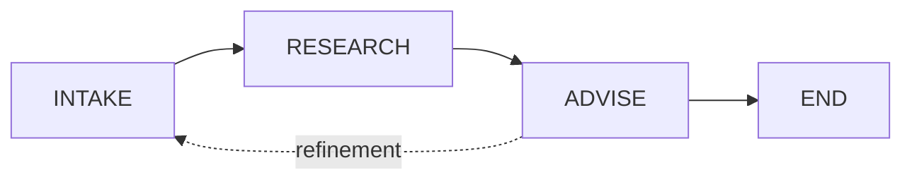

# Shortlist

<p align="center">
  
</p>

**AI-powered product research and comparison.** Tell Shortlist what you want to buy, and it builds a curated comparison table with trade-off analysis.

<p align="center">
  <a href="https://www.python.org/downloads/"></a>
  <a href="#"></a>
</p>

---

## Overview

Manual product research is tedious. Users spend hours across review sites, retailer pages, and forums trying to answer: "What should I buy?" Shortlist solves this with **progressive refinement** — users narrow down through conversation, not upfront filters. The system learns what matters as the dialogue unfolds.

### Goals

| Goal | Description |
|------|-------------|
| **Curated Shortlists** | Surface the best 5 options, not a wall of search results |
| **Structured Comparison** | Build comparison tables with dimensions that matter to the user |
| **Trade-off Analysis** | Explain why each product made the list and what you're giving up |
| **Iterative Refinement** | "More like this but cheaper" — refine without starting over |

### Example Interaction

> **User:** I want a kettle with variable temperature, under £50
>
> **Shortlist:** What's most important—speed, capacity, or build quality?
>
> **User:** Build quality, prefer stainless steel
>
> **Shortlist:** Researching... Found 24 options. Here's your shortlist:
>
> | Product | Price | Material | Temp Control | Rating |
> |---------|-------|----------|--------------|--------|
> | Fellow Stagg | £45 | Steel | 5 presets | 4.8★ |
> | Bonavita | £38 | Steel | Variable | 4.6★ |
>
> The Fellow Stagg wins on build quality. Bonavita is best value.
>
> **User:** Find me 5 more like the Fellow but under £40

<p align="center">
  
</p>

---

## Architecture

Shortlist uses a **three-phase state-driven workflow**. All phases share a single state object, and transitions are determined by conditions on that state.



| Phase | Nature | Purpose |
|-------|--------|---------|
| **INTAKE** | Conversational | Gather requirements through dialogue |
| **RESEARCH** | Automated | Find candidates and build comparison table |
| **ADVISE** | Conversational | Present results and handle refinement |

### Refinement Loop

| User Intent | Transition |
|-------------|------------|
| "I'm done" / selects product | → END |
| "Add energy efficiency to comparison" | → RESEARCH (enrich only) |
| "Find me 10 more like these" | → RESEARCH (new search) |
| "Actually, budget is now £30" | → INTAKE |

---

## Tech Stack

| Layer | Technology | Purpose |
|-------|------------|---------|
| **Chat Interface** | [Chainlit](https://docs.chainlit.io/) | Real-time chat UI, file uploads, auth |
| **Workflow Engine** | [LangGraph](https://langchain-ai.github.io/langgraph/) | Multi-agent orchestration, state management |
| **LLM Integration** | OpenAI / Anthropic | LLM abstraction, structured outputs |
| **Data Enrichment** | Lattice | Bulk web enrichment for comparison tables |
| **Data Validation** | [Pydantic](https://docs.pydantic.dev/) v2 | Type safety, schema validation |
| **Database** | PostgreSQL + asyncpg | Persistent storage, async queries |
| **File Storage** | S3 (LocalStack for dev) | File uploads, CSV exports |
| **Infrastructure** | Terraform | AWS IaC (ECS Fargate, RDS, ALB) |
| **CI/CD** | GitHub Actions | Automated testing, deployment |

---

## Quick Start

### Prerequisites

- Python 3.12+
- [uv](https://docs.astral.sh/uv/getting-started/installation/) package manager
- Docker & Docker Compose

### Setup

```bash
# Clone and install
git clone https://github.com/your-org/shortlist.git
cd shortlist
uv sync

# Configure environment
cp .env.example .env
# Edit .env - minimum required: OPENAI_API_KEY
```

### Run

```bash
# Start database + app
make up

# Or app only (if you have Postgres running elsewhere)
make dev
```

Open [http://localhost:8000](http://localhost:8000)

---

## Commands

Run `make help` for all available commands.

| Command | Description |
|---------|-------------|
| `make dev` | Start Chainlit dev server |
| `make up` | Start all services (Docker) |
| `make down` | Stop all services |
| `make test` | Run tests |
| `make check` | Lint & format check |
| `make db-migrate` | Run database migrations |
| `make docs` | Serve documentation locally |

---

## Project Structure

```
shortlist/
├── app/
│   ├── agents/           # LangGraph workflow (intake, research, advise nodes)
│   ├── services/         # Business logic (LLM, Lattice, web search)
│   ├── models/           # Pydantic state models
│   ├── chat/             # Chainlit handlers
│   ├── config/           # Settings and configuration
│   └── data/             # Static data files
├── infrastructure/       # Terraform IaC (AWS ECS, RDS, etc.)
├── tests/                # Test suite
├── docs/                 # Architecture & development docs
└── scripts/              # Utility scripts
```

---

## Documentation

| Topic | Link |
|-------|------|
| Architecture Spec | [`SPEC.md`](./SPEC.md) |
| Shortlist Design | [`SHORTLIST_SPEC.md`](./SHORTLIST_SPEC.md) |
| Development | [`docs/development/`](./docs/development/) |

---

## Scope

| In Scope | Out of Scope |
|----------|--------------|
| Any product category (generalised) | Vertical-specific optimisations |
| Single-session conversations | Persistent user accounts |
| Web-scraped product data | Retailer API integrations |
| Comparison and recommendation | Checkout or payment |
